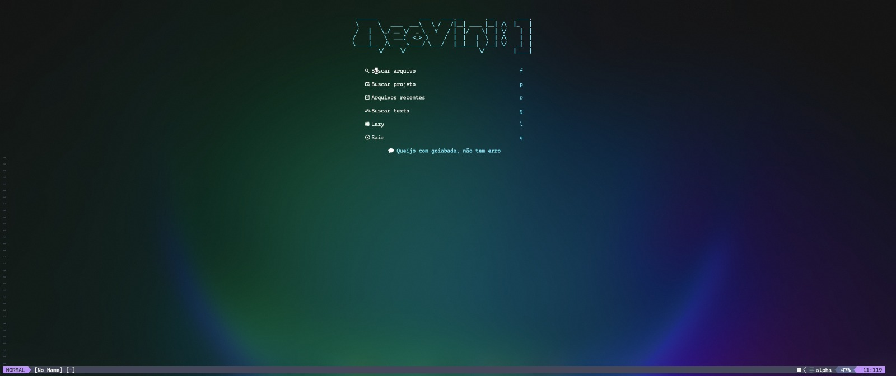
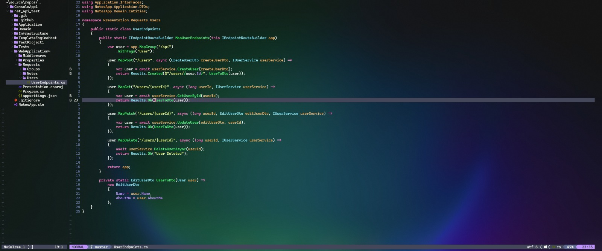

# NeoVini - Uma Configuração Neovim Completa para C# .NET


Configuração completa para o Neovim (v0.9+), transformando-o em uma IDE moderna e rápida para o desenvolvimento de aplicações C# .NET.




## ✨ Funcionalidades

* **Gerenciamento de Pacotes:** `lazy.nvim` para performance e carregamento preguiçoso.
* **Tela de Início Personalizada:** `alpha-nvim` com o logo "NeoVini :]", menu de atalhos e frases aleatórias em "mineirês".
* **LSP (IntelliSense):** Configuração automática de `csharp-ls` via `mason.nvim`.
* **Autocompletar:** `nvim-cmp` com fontes para LSP, snippets, buffers e caminhos.
* **Depurador (Debugger) Inteligente:**
    * Integração total com `netcoredbg` via `nvim-dap` e `nvim-dap-ui`.
    * **Build automático:** O projeto selecionado é compilado antes de iniciar a depuração.
    * **Seleção de Projeto:** Interface com `telescope.nvim` para escolher qual projeto depurar em soluções com múltiplos projetos.
    * **Abertura de Navegador:** Inicia o navegador automaticamente para depurar Web APIs.
* **Terminal Integrado:** Gerenciamento avançado de terminais com `toggleterm.nvim`, com fechamento automático e atalhos intuitivos.
* **Busca Inteligente:** `telescope.nvim` para buscar arquivos, texto, buffers e mais.
* **Integração com Git:** `gitsigns.nvim` para visualizar alterações diretamente no editor e realizar ações de hunk.
* **Interface de Usuário (UI) Sofisticada:**
    * **Tema:** Dracula com fundo transparente.
    * **Barra de Status:** `lualine.nvim`.
    * **Explorador de Arquivos:** `nvim-tree.lua`.
    * **Ícones:** `nvim-web-devicons`.
* **Syntax Highlighting:** `nvim-treesitter` para uma coloração de sintaxe mais precisa.

---
## 🚀 Pré-requisitos

Antes de instalar, é **essencial** garantir que os seguintes programas estejam instalados e acessíveis no seu sistema:

1.  **Neovim (v0.9.0 ou superior)**.
2.  **Git**.
3.  **.NET SDK** (Recomendado .NET 8 ou superior).
4.  **Debugger `netcoredbg` (Instalação Manual para Windows):**
    * **Passo 1:** Vá para a [página de Releases do netcoredbg no GitHub](https://github.com/Samsung/netcoredbg/releases).
    * **Passo 2:** Encontre a versão mais recente e, na seção "Assets", baixe o arquivo `netcoredbg-win-x64.zip`.
    * **Passo 3:** Crie uma pasta chamada `netcoredbg` diretamente no seu disco `C:\`.
    * **Passo 4:** Extraia **todo o conteúdo** do arquivo `.zip` para dentro da pasta `C:\netcoredbg`.
    * **Pronto!** A configuração do NeoVini já está apontando para `C:/netcoredbg/netcoredbg.exe`, então o debugger funcionará sem passos adicionais.
5.  **Nerd Font:** Essencial para os ícones. Recomenda-se a [FiraCode Nerd Font](https://www.nerdfonts.com/font-downloads). Após instalar, **configure seu terminal** para usá-la.
6.  **Ferramentas de Build (Compilador C):** `gcc` e `make` (ou equivalentes no Windows).
7.  **Utilitários de Busca (Para o Telescope):** `ripgrep` e `fd`.

---
## 📦 Instalação

1.  **Faça um backup** da sua configuração atual:
    ```powershell
    mv ~/.config/nvim ~/.config/nvim.bak
    ```

2.  **Clone este repositório** para a pasta de configuração do Neovim:
    ```bash
    git clone <URL_DO_SEU_REPOSITORIO> ~/.config/nvim
    ```

3.  **Inicie o Neovim:**
    ```bash
    nvim
    ```
Na primeira inicialização, `lazy.nvim` irá baixar, instalar e configurar todos os plugins automaticamente. Aguarde o processo terminar e reinicie o Neovim.

---
## 🕹️ Guia de Uso e Atalhos Principais

**Tecla Líder:** A tecla `<leader>` está mapeada para a tecla **`<Espaço>`**.

| Categoria | Atalho | Ação |
| :--- | :--- | :--- |
| **🚀 Ações Principais** | | |
| | `<Espaço> r` | Rodar projeto .NET (abre seletor de .csproj). |
| | `<F5>` | **Debugar Projeto:** Abre seletor de .csproj, compila e inicia o debug. |
| | `<C-s>` | Salvar arquivo. |
| **🪟 Janelas e Buffers** | | |
| | `<C-j/k/h/l>` | Mover entre janelas (splits). |
| | `<Espaço> q` | Fechar o buffer (arquivo) atual. |
| **🔍 Busca (Telescope)** | | |
| | `<Espaço> ff` | Buscar Arquivos no projeto. |
| | `<Espaço> fg` | Buscar Texto em todo o projeto. |
| **🧠 LSP (IntelliSense)** | | |
| | `gd` | Ir para a Definição. |
| | `K` | Mostrar Documentação (Hover). |
| | `<Espaço> ca` | Ver Ações de Código disponíveis. |
| **🐞 Depurador (DAP)** | | |
| | `<F10>` / `<F11>` / `<F12>` | Step Over / Step Into / Step Out. |
| | `<Shift>+<F5>` | Terminar a sessão de debug. |
| | `<Espaço> b` | Adicionar ou remover um Breakpoint. |
| | `<Espaço> du` | Mostrar / Esconder a interface do debugger. |
| **🌿 Git (Gitsigns)** | | |
| | `]h` / `[h` | Pular para o próximo / anterior bloco de alteração. |
| | `<Espaço> hs` | Adicionar Hunk ao `git stage`. |
| | `<Espaço> hr` | Reverter alterações do Hunk. |
| **💻 Terminal (ToggleTerm)** | | |
| | `<Espaço> ft` | Abrir/Fechar Terminal Flutuante. |
| | `<Espaço> vt` | Abrir/Fechar Terminal Vertical. |
| | `<Espaço> gg` | Abrir/Fechar LazyGit (se instalado). |
| | `<Esc>` | **No Modo Terminal:** Sair para o Modo Normal. |
| **✨ UI e Plugins** | | |
| | `<Espaço> e` | Abrir / Fechar o explorador de arquivos (Nvim-Tree). |

---
## 🎨 Personalização

* **Mudar o Tema:** Edite `lua/plugins/themes.lua`.
* **Adicionar Plugins:** Crie um novo arquivo `.lua` em `lua/plugins/` com a especificação do `lazy.nvim`.
* **Mudar Atalhos Gerais:** Edite `lua/core/keymaps.lua`.
* **Mudar Atalhos de Plugins:** Edite o arquivo do plugin correspondente (ex: `lua/plugins/toggleterm.lua`).

---
## ⚠️ Solução de Problemas (FAQ)

* **Problema: Ícones aparecem como quadrados.**
    * **Solução:** Garanta que você instalou uma **Nerd Font** e a configurou como a fonte principal do seu emulador de terminal (Windows Terminal, etc.).

* **Problema: O debugger (`<F5>`) falha ou o processo fecha imediatamente.**
    * **Causa:** Incompatibilidade entre a versão do .NET do seu projeto e os Runtimes .NET instalados.
    * **Solução:** Verifique o `<TargetFramework>` no `.csproj` e garanta que a versão correspondente está na lista de `dotnet --list-runtimes`. Se não estiver, instale o **.NET Runtime** ausente.

* **Problema: Ao depurar, o Swagger retorna 404.**
    * **Causa:** O debugger iniciou a aplicação em modo de `Production`.
    * **Solução:** Verifique se a variável `ASPNETCORE_ENVIRONMENT = 'Development'` está definida em `lua/plugins/dap.lua`.

* **Problema: Erro de `module not found` ao iniciar o Neovim.**
    * **Causa:** Um arquivo de configuração (como `keymaps.lua`) está tentando usar um plugin (`require('toggleterm')`) antes de o `lazy.nvim` tê-lo carregado.
    * **Solução:** Defina os atalhos de plugins "preguiçosos" usando a propriedade `keys` na sua especificação em `lua/plugins/`, em vez de defini-los globalmente em `keymaps.lua`.

* **Comando Universal de Diagnóstico:**
    * Dentro do Neovim, execute `:checkhealth`. Ele fornecerá um relatório detalhado sobre possíveis problemas.
